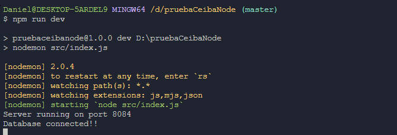
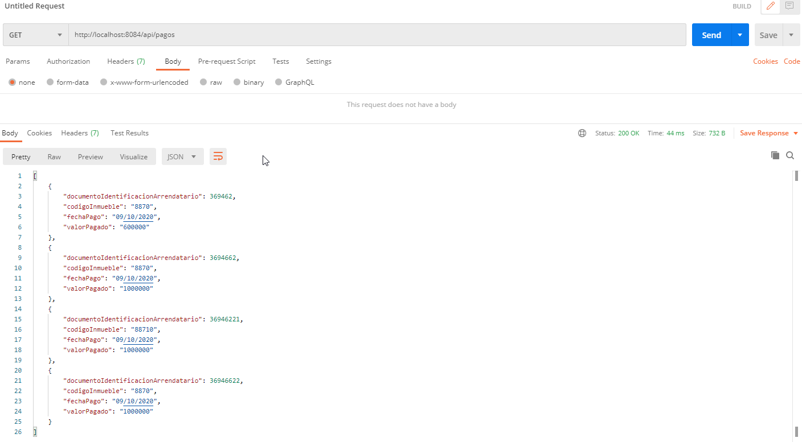
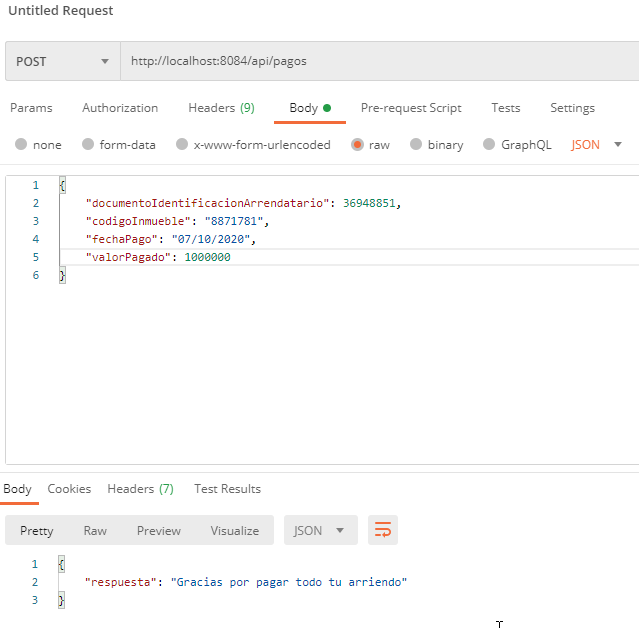
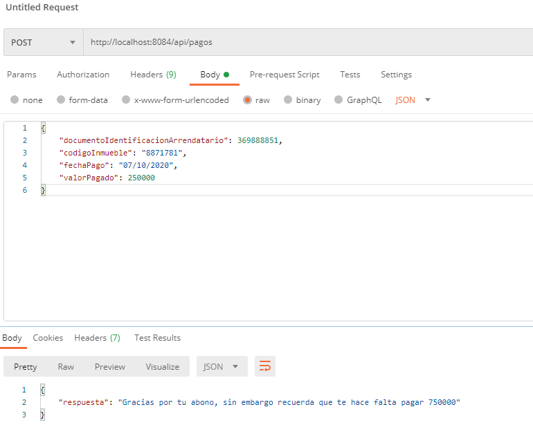
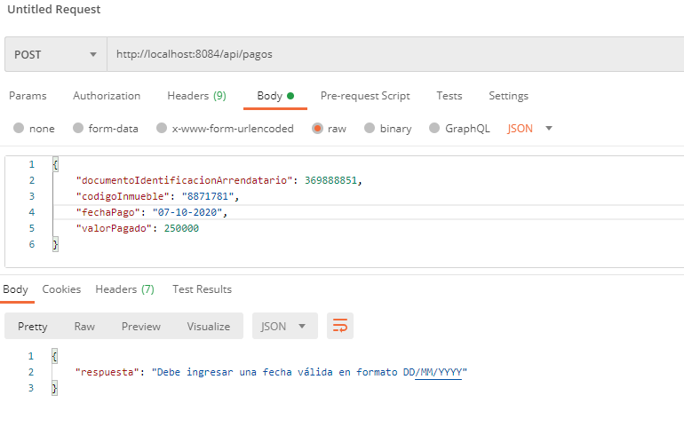
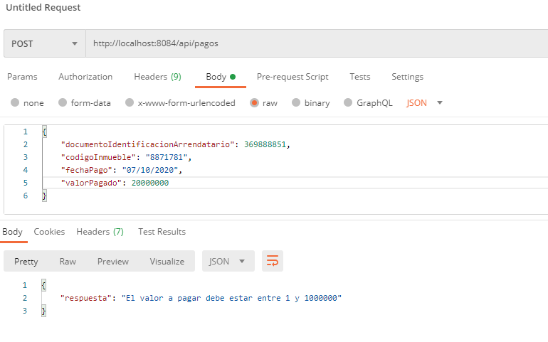
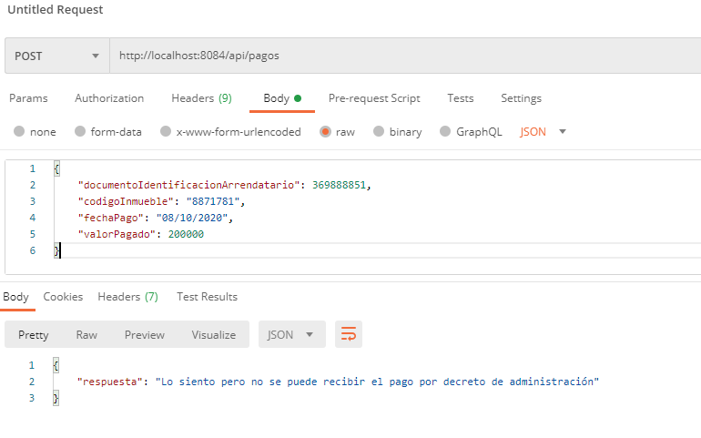
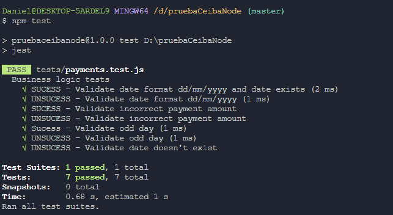

# Sistema de pagos de Arriendo (Prueba node ceiba)

Repositorio del api de la prueba de node para la empresa ceiba, en este se describiran las funcionalidades del API asi como también su puesta en marcha.

La aplicación fue desarrollada usando Node como entorno, express como framework para inicializar el servidor, sequelize como ORM para interactuar con la base de datos MySQL y JEST para realizar pruebas unitarias.

## Nota: el API se encuentra desplegada en el siguiente enlace
 

### Enlace del API: https://pruebaceiba-danimb.herokuapp.com/api/pagos

 

# Puesta en Marcha en desarrollo

## Para poner en marcha la aplicación se deben tener ciertos requisitos:

- Tener un servicio de MySQL corriendo en local con el usuario 'ceiba' habilado con permisos de lectura y escritura.
- Tener Node instalado

## Pasos:

1) Ubicarse en la ruta donde se tiene el proyecto
2) Ejecutar el comando: ***npm install*** para instalar las librerías necesarias
3) Ejecutar el comando: ***npm start*** para iniciar la aplicacion con node ó ***npm run dev*** para inicializar en desarrollo usando nodemon
4) al ejecutar este proceso se nos debe mostrar en la consola algo como esto:

# Funcionamiento del API

a continuación se describiran los ***endpoints*** y sus funcionalidades

Por defecto el API correrá en el puerto ***8084*** por lo que para consumir el api en local debemos seguir la siguiente ruta(Usando postman o un navegador):

- http://localhost:8084/api/pagos

El anterior enlace se puede consumir con dos metodos **GET** y **POST**.

## Cuando lo consumimos usando el método get obtenemos la lista de todos los pagos que se han realizado:

## Cuando lo consumimos usando el método post podremos obtener diferentes resultados según los parametros envíados en el body:
 

- Si es un pago nuevo y se cumple con el pago total la respuesta será:

 

 

- si es un pago parcial la respuesta será la siguiente:

 

 

- si se manda una fecha incorrecta(que no esté en el calendario) ó que no cumpla con el formato dd/mm/yyyy la respuesta será la siguiente:

 

 

- si el valor de pago es inferior a 1 o mayor a 1000000 la respuesta será la siguiente:

 

 

- si la fecha es un día **par** la respuesta será la siguiente:

 

# Pruebas

Para ejecutar las pruebas unitarias, se debe ejecutar el comando: ***npm test*** y la respuesta en consola debe ser:

